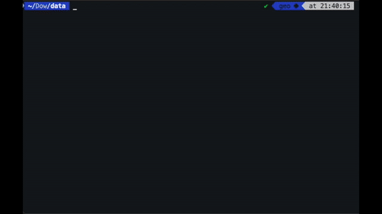
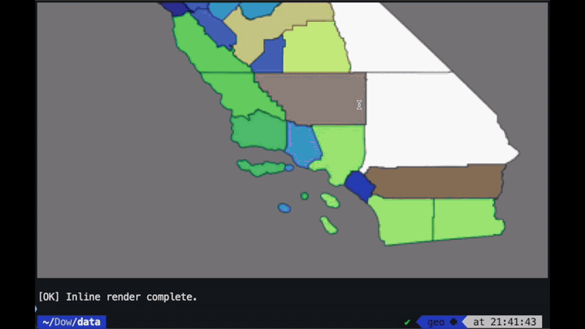

# viewinline
[](https://pepy.tech/project/viewinline)
[](https://pypi.org/project/viewinline/)
[](https://pypi.org/project/viewinline/)

**Quick-look geospatial viewer for compatible terminals.**  
Displays rasters, vectors, and tabular data directly in the terminal with no GUI and no temporary files.

<p align="center">
  <a href="viewinline_gif1.gif"></a>
  <a href="viewinline_gif2.gif"></a>
</p>

Think of it as `ls` for geospatial files — designed for quick visual inspection at the command line, not a replacement for QGIS, ArcGIS, or analytical workflows.

Particularly useful on HPC systems and remote servers accessed via SSH. Images render on your local terminal without X11 forwarding, VNC, or file downloads.

This tool combines the core display logic of `viewtif` and `viewgeom`, but is **non-interactive**: you can't zoom, pan, or switch colormaps on the fly. Instead, you control everything through command-line options (e.g. --display, --color-by, --colormap).

It uses the iTerm2 inline image protocol (OSC 1337) to render previews. In incompatible terminals, the escape codes are silently ignored with no errors or crashes.

## Installation  
Requires Python 3.9 or later.  

```bash
pip install viewinline
```

## Usage
```bash
# Rasters
viewinline path/to/file.tif
viewinline R.tif G.tif B.tif                 # RGB composite (also works with --rgbfiles)
viewinline path/to/multiband.tif --rgb 3 2 1
viewinline path/to/folder --gallery 4x3      # show image gallery (e.g. 4x3 grid)

# NetCDF and HDF
viewinline file.nc                           # list variables
viewinline file.nc --subset 2                # display variable 2
viewinline file.nc --subset 1 --band 10      # variable 1, timestep 10 --band or --timestep
viewinline temp.nc --subset 1 --colormap plasma --vmin 273 --vmax 310

# Vectors
viewinline path/to/vector.geojson
viewinline boundaries.geoparquet --color-by population --colormap viridis

# CSV and Parquet
viewinline data.csv                          # preview rows and columns
viewinline data.parquet --describe           # summary statistics
viewinline data.csv --hist                   # histograms for all numeric columns
viewinline data.csv --hist area_km2          # histogram for one column
viewinline data.csv --scatter X Y            # scatter plot
viewinline data.csv --where "year > 2010"    # filter rows
viewinline data.csv --sort population --desc # sort rows
viewinline data.csv --sql "SELECT * FROM data WHERE area > 100 ORDER BY year"  # full SQL

# Tabular view of vectors
viewinline counties.shp --table              # view shapefile as table
viewinline counties.shp --table --describe   # summary statistics
viewinline counties.shp --table --unique STATE_NAME
viewinline data.geoparquet --table --where "POP > 100000" --sort POP --desc
```

## Compatible terminals

The iTerm2 inline image protocol (OSC 1337) is supported by:

- **iTerm2** (macOS)
- **WezTerm** (cross-platform)
- **Konsole** (Linux/KDE)
- **Rio**, **Contour** (cross-platform)

**Not compatible:** Mac Terminal, GNOME Terminal, Kitty (uses different protocol), Ghostty, Alacritty

**SSH/HPC usage:** Works over SSH when connecting from a compatible terminal. Images render on your local machine, not the remote server. No X11 forwarding or VNC required.

**tmux/screen:** Inline images don't work inside tmux or screen sessions, even with `allow-passthrough on`. Use a plain terminal tab.

## Features  
- Previews rasters, vectors, and tabular data directly in the terminal  
- Non-interactive: everything is controlled through command-line options
- **NetCDF/HDF Support:** Display variables from NetCDF (.nc) and HDF5 (.h5, .hdf5) files with automatic nodata detection and multi-slice navigation
- **Parquet/GeoParquet:** Render GeoParquet as vector maps or view as tabular data
- **Tabular View for Vectors:** Use `--table` to access CSV-style operations (filter, sort, describe, hist) on any vector file  

## Supported formats  
**Rasters**  
- GeoTIFF (.tif, .tiff)
- PNG, JPEG (.png, .jpg, .jpeg)
- NetCDF (.nc)
- HDF5 (.h5, .hdf5)
- HDF4 (.hdf) — requires GDAL with HDF4 support
- Single-band or multi-band composites 

**Composite inputs**  
- You can pass three rasters (e.g. `R.tif G.tif B.tif`) or use `--rgbfiles R.tif G.tif B.tif` to create an RGB composite
- Multi-band files: use `--rgb 3 2 1` to specify band order

**Vectors**  
- GeoJSON (`.geojson`)  
- Shapefile (`.shp`)  
- GeoPackage (`.gpkg`)
- Parquet/GeoParquet (`.parquet`, `.geoparquet`)

**Tabular data (CSV and Parquet)**
- CSV (`.csv`)
- Parquet (`.parquet`) — requires `pyarrow`
- All CSV operations work on parquet files
- Preview file summary (rows, columns, and names)
- Summary statistics with `--describe`
- Inline histograms with `--hist`
- Scatter plots with `--scatter X Y`
- Filter rows with `--where`, sort with `--sort`, limit output with `--limit`
- Full SQL queries with `--sql` (DuckDB required) — use `data` as the table name

**Tabular view of vectors**
- Use `--table` flag to view any vector file (shapefiles, GeoPackage, GeoParquet) as tabular data
- Enables all CSV-style operations: `--describe`, `--hist`, `--scatter`, `--unique`, `--where`, `--sort`

**Gallery view**
- Display all images in a folder with `--gallery 4x4`

**NetCDF/HDF notes:**
- viewinline lists only variables that can be displayed as 2D or 3D arrays
- Variables with additional dimensions (e.g., vertical levels) may be listed but will fail to display with a clear error message
- For a complete variable list, use `ncdump -h file.nc` or `viewtif`

## Dependencies

**Core dependencies** (installed automatically):
- `rasterio` — raster reading (includes GDAL)
- `geopandas`, `pyogrio` — vector reading
- `matplotlib` — vector rendering
- `Pillow` — image encoding
- `numpy`, `pandas` — data handling

**Optional dependencies:**
- `duckdb` — required for `--where`, `--sort`, `--sql`, `--limit` with filtering
  ```bash
  pip install duckdb
  ```
- `pyarrow` — required for Parquet/GeoParquet files
  ```bash
  pip install pyarrow
  ```
- `h5py` — fallback for HDF5 files if GDAL lacks HDF5 support (usually not needed)
  ```bash
  pip install h5py
  ```

**Note on HDF support:**
- **HDF5** (.h5, .hdf5): Supported via rasterio if GDAL has HDF5 support (most installations)
- **HDF4** (.hdf): Requires GDAL compiled with HDF4 support (common in MODIS data)
- **NetCDF** (.nc): Supported via rasterio (uses GDAL's NetCDF driver)

## Available options
```
General:
  --display DISPLAY     Resize only the displayed image (0.5=smaller, 2=bigger). Default: auto-fit to terminal.

Raster:
  --band BAND           Band number to display (single raster), or slice number for NetCDF. (default: 1)
  --timestep INTEGER    Alias for --band when working with NetCDF files.
  --subset INTEGER      Variable index for NetCDF/HDF files (e.g., --subset 1).
  --colormap            Apply colormap to single-band rasters. Flag without the color scheme → 'terrain'.
  --rgb R G B           Three band numbers for RGB display (e.g., --rgb 4 3 2). Overrides default 1 2 3.
  --rgbfiles R G B      Three single-band rasters for RGB composite. Can also provide as positional arguments.
  --vmin VMIN           Minimum pixel value for raster display scaling.
  --vmax VMAX           Maximum pixel value for raster display scaling.
  --nodata NODATA       Override nodata value for rasters if dataset metadata is missing or incorrect.
  --gallery [GRID]      Display all PNG/JPG/TIF images in a folder as thumbnails (e.g., 5x5 grid).

Vector:
  --color-by COLUMN     Column to color vector features by.
  --colormap            Apply colormap to vector coloring. Flag without value → 'terrain'.
  --width WIDTH         Line width for vector boundaries. (default: 0.7)
  --edgecolor COLOR     Edge color for vector outlines (hex or named color). (default: white)
  --layer LAYER         Layer name for GeoPackage/multi-layer files, or variable name for NetCDF files.
  --table               Display vector/parquet file as tabular data instead of rendering geometry.

CSV and Parquet:
  --describe [COLUMN]   Show summary statistics for all numeric columns or specify one column name.
  --hist [COLUMN]       Show histograms for all numeric columns or specify one column name.
  --bins BINS           Number of bins for histograms (used with --hist). (default: 20)
  --scatter X Y         Plot scatter of two numeric columns (e.g., --scatter area_km2 year).
  --unique COLUMN       Show unique values for a categorical column.
  --where EXPR          Filter rows using SQL WHERE clause (DuckDB required). Example: --where "year > 2010"
  --sort COLUMN         Sort rows by column, ascending by default. Use --desc to reverse.
  --desc                Sort in descending order (used with --sort).
  --limit N             Limit number of rows shown (e.g., --limit 100).
  --select COLUMNS      Select specific columns (space separated). Example: --select Country City
  --sql QUERY           Execute full DuckDB SQL query. Use 'data' as table name. Example: --sql "SELECT * FROM data WHERE Poverty > 40"
```

## Need help?
NASA staff can ask questions about usage via the documentation-based assistant 'viewtif + viewgeom + viewinline Helper' via the ChatGSFC Agent Marketplace.

## License
This project is released under the Apache License 2.0 © 2026 Keiko Nomura.

If you find this tool useful, please consider supporting or acknowledging it in your work. 

## Useful links
- [YouTube demo playlist](https://www.youtube.com/playlist?list=PLP9MNCMgJIHj6FvahJ6Tembp1rCyhLtR4)
- [Demo at the initial release](https://www.linkedin.com/posts/keiko-nomura-0231891_just-released-viewinline-for-those-using-activity-7390643680770023424-8Guu?utm_source=share&utm_medium=member_desktop&rcm=ACoAAAA0INsBVIO1f6nS_NkKqFh4Na1ZpoYo2fc)
- [Demo for the v0.1.3](https://www.linkedin.com/posts/keiko-nomura-0231891_just-released-viewinline-v013-for-iterm2-activity-7391633864798081025-dPbk?utm_source=share&utm_medium=member_desktop&rcm=ACoAAAA0INsBVIO1f6nS_NkKqFh4Na1ZpoYo2fc)
- [Demo with GDAL](https://www.linkedin.com/posts/keiko-nomura-0231891_if-you-use-gdal-heres-a-quick-example-workflow-activity-7390892270847373312-XWZ4?utm_source=share&utm_medium=member_desktop&rcm=ACoAAAA0INsBVIO1f6nS_NkKqFh4Na1ZpoYo2fc)
- [User feedback (thank you!)](https://www.linkedin.com/posts/jamshidsodikov_shout-out-to-keiko-nomura-for-viewinline-activity-7390979602539528192-S8JQ?utm_source=share&utm_medium=member_desktop&rcm=ACoAAAA0INsBVIO1f6nS_NkKqFh4Na1ZpoYo2fc)
